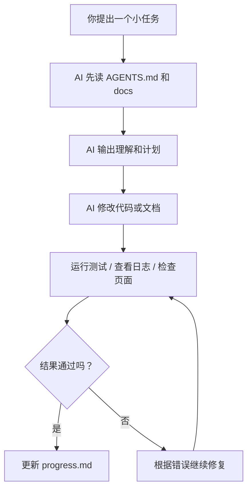

# Harness Engineering 原理与使用方法

## 1. 什么是 Harness Engineering

Harness Engineering 可以理解成：**不给 AI 只发一句提示词，而是给它一套能稳定工作的环境、规则、文档和反馈闭环。**

传统做法更像是：

- 你问一句
- AI 回一段
- 结果好不好，靠人自己判断

Harness Engineering 的做法更像是：

- 先给 AI 一个清晰任务
- 再给它上下文、文件结构、工具和约束
- 让它执行后自动验证
- 根据验证结果继续修正

重点不是“让 AI 一次说对”，而是“让 AI 在一个系统里持续做对”。

## 2. 核心原理总结

### 2.1 AI 的上限不只取决于模型，也取决于环境

很多时候 AI 做不好，不是因为模型太弱，而是因为：

- 任务边界不清楚
- 项目知识分散在聊天、脑子里、飞书里
- 没有验收标准
- 没有测试、日志、截图这些反馈
- 一次让 AI 做太多事

所以，Harness 的作用是把“模糊协作”变成“可执行流程”。

### 2.2 要把大任务拆成小闭环

AI 最怕这种任务：

- “帮我做一个完整 app”
- “把整个项目重构一下”
- “你看着改到最好”

更有效的做法是每次只做一个小闭环：

1. 定义目标
2. 提供上下文
3. 实现
4. 验证
5. 记录结果

这比堆长提示词稳定得多。

### 2.3 仓库要成为唯一真相来源

如果关键信息只存在于：

- 口头沟通
- 微信/飞书/Slack
- 你自己的脑子里

那么 AI 每次都会重新猜。

更稳的方式是把知识放进仓库，例如：

- `AGENTS.md`：项目地图
- `docs/architecture.md`：架构说明
- `docs/tasks.md`：当前任务
- `docs/progress.md`：当前进度和遗留问题

这样 AI 每次都能从同一套事实出发。

### 2.4 让 AI 先做，再验证，再修

AI 不是一次性交付工具，而是更适合在循环里工作：

1. 生成方案或代码
2. 跑测试 / 看日志 / 看页面
3. 发现问题
4. 修复
5. 再验证

这个闭环越短，效果越好。

### 2.5 提示词重要，但不应独自承担全部责任

提示词只能解决一部分问题。真正稳定的效果，通常来自下面四样东西一起工作：

- 提示词
- 文档
- 文件结构
- 自动验证

如果只有提示词，没有结构，AI 的表现通常不稳定。

## 3. 小白最适合的核心搭建架构

下面是一套适合个人开发者的最小可用架构。目标不是复杂，而是**容易理解、容易维护、容易复用**。

### 3.1 最小目录结构

```text
your-project/
├─ AGENTS.md
├─ docs/
│  ├─ architecture.md
│  ├─ tasks.md
│  ├─ progress.md
│  └─ decisions.md
├─ src/
├─ tests/
└─ README.md
```

### 3.2 每个文件的作用

#### `AGENTS.md`

放“项目地图”，不是百科全书。它只回答这几个问题：

- 这个项目做什么
- 重要文档去哪里看
- 改代码前先看哪些文件
- 哪些目录能改，哪些不要乱动
- 修改后要运行什么验证命令

#### `docs/architecture.md`

放系统结构，帮助 AI 快速理解项目：

- 页面或模块有哪些
- 数据流怎么走
- API 在哪里
- 状态管理怎么做
- 当前有哪些技术限制

#### `docs/tasks.md`

放待办列表。建议每条任务都很小，例如：

- 修复登录按钮 loading 状态
- 给用户资料页补空态
- 给计时器逻辑补测试

#### `docs/progress.md`

记录最近做了什么、还有什么没做完。这个文件非常重要，因为它能帮 AI 在下一轮接上上下文。

#### `docs/decisions.md`

记录已经定下来的技术决定，例如：

- 为什么选 React Native
- 为什么先不用 Zustand
- 为什么某个模块暂时不抽象

这样可以减少 AI 每次“重新发明方案”。

## 4. 小白可直接照抄的工作流

### 4.1 第一步：先准备文档，不要先堆提示词

建议先写好：

1. `AGENTS.md`
2. `docs/architecture.md`
3. `docs/tasks.md`
4. `docs/progress.md`

写完这 4 个文件，AI 的稳定性通常会明显提升。

### 4.2 第二步：每次只让 AI 做一个小任务

正确示例：

- 帮我修复番茄钟结束后没有弹窗的问题
- 帮我给登录页增加邮箱格式校验
- 帮我给猫咪状态组件补一个单元测试

不推荐示例：

- 帮我把整个产品做完
- 帮我把 UI 全部优化一下
- 帮我整体重构

### 4.3 第三步：每次都给验收标准

不要只说“帮我实现”。要说清楚：

- 用户完成什么操作
- 页面应该看到什么
- 数据应该怎么变化
- 运行什么命令算通过

### 4.4 第四步：让 AI 先读上下文再开始

每次开工前，让 AI：

1. 阅读 `AGENTS.md`
2. 阅读相关文档
3. 阅读目标模块代码
4. 先总结理解
5. 再开始改

这样能显著减少乱改和误解。

### 4.5 第五步：要求 AI 做自检

完成后让 AI 必须输出：

- 改了哪些文件
- 为什么这么改
- 跑了什么验证
- 哪些风险还没覆盖

这一步能让你更容易判断结果是否靠谱。

## 5. 小白版 Harness 的核心架构图



这个图的重点是：**AI 不是答完就结束，而是进入一个带反馈的循环。**

## 6. 推荐的提示词搭建方式

不要把所有要求塞进一句超长提示词。更推荐拆成 4 层。

### 6.1 第 1 层：角色层

告诉 AI 它当前扮演什么角色。

示例：

```text
你现在是这个项目的协作开发助手。你的任务不是一次性猜对所有需求，而是先理解项目结构，再在限定范围内完成一个小任务，并在完成后说明验证结果和剩余风险。
```

### 6.2 第 2 层：项目层

告诉 AI 应该先读哪里。

示例：

```text
开始之前，请先阅读 AGENTS.md、docs/architecture.md、docs/tasks.md 和与当前任务相关的代码文件。先总结你的理解，再开始修改。
```

### 6.3 第 3 层：任务层

明确这次要做什么。

示例：

```text
本次任务：为登录页增加邮箱格式校验，并在格式错误时显示错误提示。只修改登录相关页面和校验逻辑，不要顺手重构其他模块。
```

### 6.4 第 4 层：验收层

明确什么叫完成。

示例：

```text
验收标准：
1. 用户输入非法邮箱时，提交按钮后出现错误提示。
2. 用户输入合法邮箱时，不显示该错误。
3. 不影响原有登录流程。
4. 如项目有测试，请运行相关测试或至少说明未运行的原因。
```

## 7. 可直接复用的提示词模板

下面是最适合个人开发者直接复制使用的模板。

### 7.1 通用开发提示词

```text
你现在是我的项目协作开发助手。

工作方式要求：
1. 先阅读 AGENTS.md、docs/architecture.md、docs/tasks.md、docs/progress.md，以及与任务相关的代码。
2. 先用简洁语言总结你对当前任务和现有实现的理解。
3. 如无明显风险，直接开始修改，不要只停留在建议层面。
4. 本次只处理当前任务范围，不要顺手重构无关模块。
5. 完成后说明：
- 修改了哪些文件
- 核心改动是什么
- 如何验证
- 还有哪些风险或未覆盖项

当前任务：
[在这里写任务]

验收标准：
[在这里写验收标准]
```

### 7.2 修 Bug 提示词

```text
你现在是我的调试助手。请先阅读相关代码，定位问题根因，再修改代码解决问题。

要求：
1. 先总结你判断的 bug 根因。
2. 优先做最小修改，避免扩大范围。
3. 如能运行测试或相关验证，请执行。
4. 完成后告诉我：
- 根因是什么
- 修改了什么
- 怎么验证问题已修复
- 还可能有哪些边界风险

当前 bug：
[在这里写现象]

期望结果：
[在这里写正确行为]
```

### 7.3 新功能提示词

```text
你现在是我的功能开发助手。请基于现有项目结构实现一个小功能。

开始前请先：
1. 阅读 AGENTS.md 和相关文档
2. 找到与该功能最相关的页面、组件、状态或接口
3. 简要说明你的实现方案

实现要求：
- 只完成本次功能范围
- 尽量复用现有代码风格和结构
- 不要引入没必要的新依赖

功能需求：
[在这里写功能]

验收标准：
[在这里写验收标准]
```

### 7.4 文档整理提示词

```text
你现在是我的项目文档助手。请根据现有代码和文档，整理并更新项目说明，保持内容准确、简洁、便于 AI 和人类共同阅读。

要求：
1. 先阅读已有文档和相关代码。
2. 不要编造未在代码中出现的能力。
3. 重点补充项目结构、模块关系、运行方式和当前限制。
4. 输出内容要适合后续 AI 继续使用。
```

## 8. 建议你先建立的 4 个文件模板

### 8.1 `AGENTS.md`

```md
# AGENTS.md

## 项目目标
- 这是一个用于 [填写项目目标] 的项目。

## 阅读顺序
- 先看 `docs/architecture.md`
- 再看 `docs/tasks.md`
- 再看 `docs/progress.md`

## 代码范围
- 主要代码目录：`src/`
- 测试目录：`tests/`
- 非必要不要修改：`android/`、`ios/`、构建配置文件

## 修改原则
- 一次只完成一个小任务
- 优先最小改动
- 保持现有风格
- 不要顺手重构无关内容

## 完成后检查
- 运行相关测试或说明未运行原因
- 更新 `docs/progress.md`
```

### 8.2 `docs/architecture.md`

```md
# Architecture

## 项目概览
- 这个项目用于 [填写项目说明]

## 主要模块
- `src/screens/`：页面
- `src/components/`：通用组件
- `src/services/`：接口和数据请求
- `src/hooks/`：复用逻辑

## 关键数据流
- 用户操作 -> 页面状态 -> 服务调用 -> UI 更新

## 当前限制
- [填写已知限制]
```

### 8.3 `docs/tasks.md`

```md
# Tasks

## 当前待办
- [ ] 修复登录页错误提示
- [ ] 给设置页增加退出登录
- [ ] 补充计时器测试

## 后续想法
- [ ] 优化首页加载体验
```

### 8.4 `docs/progress.md`

```md
# Progress

## 最近完成
- [日期] 完成了什么

## 当前状态
- 正在处理什么

## 遗留问题
- 还有哪些没完成

## 下次开始前建议阅读
- 哪些文件最相关
```

## 9. 小白最容易踩的坑

### 9.1 一次提太大任务

这会导致 AI：

- 忽略细节
- 擅自扩展范围
- 做完一半就说完成

### 9.2 没有验收标准

如果没有验收标准，AI 会按自己的理解交付，而不是按你的目标交付。

### 9.3 文档不落盘

如果关键信息只在聊天里，下一次协作还得重新解释。

### 9.4 不做验证

AI 经常能写出“看起来合理”的代码，但运行后不一定对。测试、日志、页面检查都很重要。

### 9.5 提示词过长但结构混乱

不是越长越好。比起一段超长提示词，更重要的是：

- 结构清楚
- 范围清楚
- 验收清楚
- 验证清楚

## 10. 一句话总结

Harness Engineering 的本质是：

**用文档、结构、任务拆分和验证闭环，让 AI 从“偶尔有用”变成“可以稳定协作”。**

对个人开发者来说，最重要的不是先学复杂框架，而是先搭好这四样东西：

1. 项目地图
2. 任务清单
3. 进度记录
4. 验收与验证流程

把这四样搭起来，再配合清晰提示词，你的 AI 开发效率会比单纯“聊天式提问”高很多。
